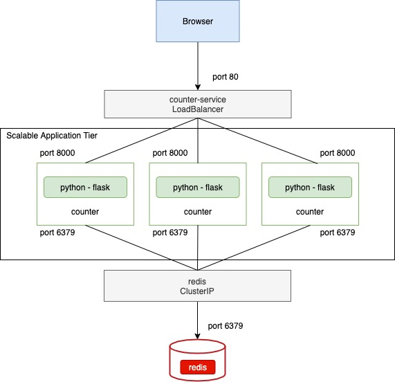
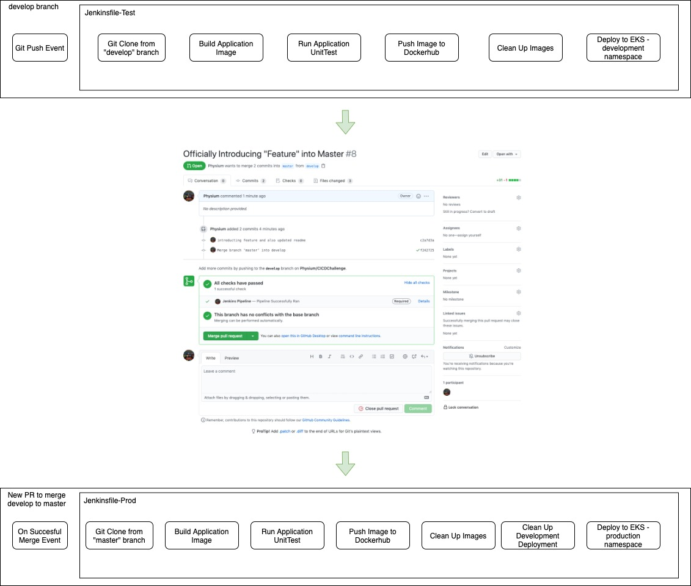

# CICDChallenge
To showcase a CI/CD application pipeline deployment.

## Application

Application in this project is a flask-based application utilizing redis cache to store the number of user's visits.

Reference: (https://morioh.com/p/1e80d49f8d3e)[https://morioh.com/p/1e80d49f8d3e]

### Application Diagram

### Kubernetes Application Diagram

## Pipeline
The choice of tool used here to manage and create pipelines is [Jenkins](https://www.jenkins.io/)

The idea is to showcase a scenario of a developer developing a new feature in the development branch and subsequently merging it into the master branch.

There are 2 Jenkins Pipelines within this repository:
* Development
* Production

### Development Pipeline
The development pipeline is essentially the main pipeline that the developers will interact with. Upon successful code push into the code repository, the pipeline will be triggered automatically to carry out a sequence of task involving building of container images, unit testing and follow up with a mock deployments into the test environment for usability testing. This pipeline heavily emphasis on the CI to ensure that whatever code push into the repository works as intended.

### Production Pipeline
The production pipieline is similar to the development pipeline. However, this pipeline will only be triggered upon successful merge of a pull request from the develop to the master branch. This pipeline will do a build of the master branch and proceed to deploy to the production environment. The master branch is protected and can only be merged upon successful status checks from the development pipeline.

### CICD Pipeline Diagram
This is a high level diagram of the pipelines as mentioned above showcasing the different task it carries out within the pipeline and also the interaction between the 2 different pipelines and it trigger points.

## Cloud Infrastructure
Applications are deployed on Amazon EKS.

Disclaimer: I not design on my own AWS environment. Environment is heavily reference from the folloowing blog post: [https://logz.io/blog/amazon-eks-cluster/](https://logz.io/blog/amazon-eks-cluster/)

## Future Works
* Use Jenkins X for better integration with Kubernetes
* Integration with SonarCube/CodeClimate for code scanning
* Integration with build platforms (In this case, Helm?)
* Integration with messaging platform
* Infrastructure as a Code within the pipelines