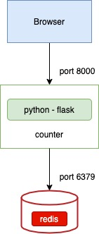
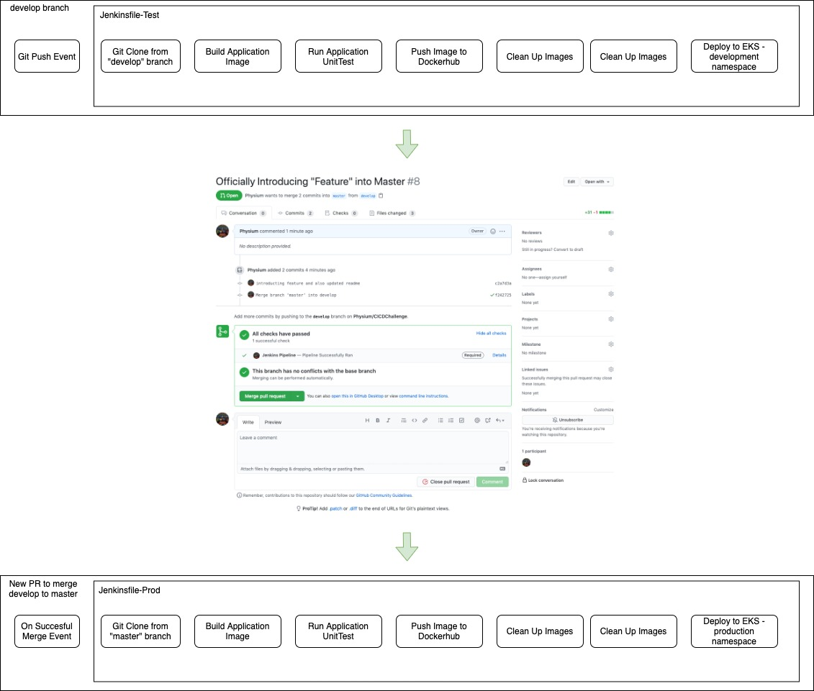

# CICDChallenge
To showcase a CI/CD application pipeline deployment.

## Application

Application in this project is a flask-based application utilizing redis cache to store the number of user's visits.

Reference: https://morioh.com/p/1e80d49f8d3e

### Application Diagram

## Pipeline
git push -> activate jenkins development pipeline

create new pull request to merge to master -> run activate jenkins development pipeline -> status check pass -> merge into master branch

upon merging into master branch -> activate jenkins production pipeline -> deploy to EKS cluster

There are 2 main pipelines:
* Development
* Production

### Development Jenkins Pipeline
git clone -> build docker image -> test application -> push docker image to dockerhub -> deploy application to EKS
### Production Jenkins Pipeline
git clone -> build docker image -> test application

### CICD Pipeline Diagram

## Cloud Infrastructure
Application is deployed on Amazon EKS.
